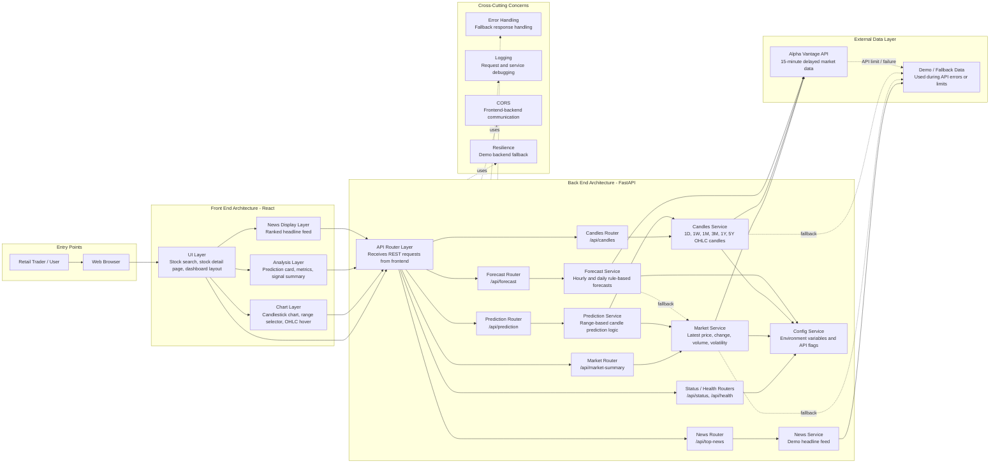

```mermaid
flowchart LR
    %% SignalScope Layered Architecture

    subgraph Entry[Entry Points]
        User[Retail Trader / User]
        Browser[Web Browser]
    end

    subgraph Frontend[Front End Architecture - React]
        UI[UI Layer<br/>Stock search, stock detail page, dashboard layout]
        ChartUI[Chart Layer<br/>Candlestick chart, range selector, OHLC hover]
        PredictionUI[Analysis Layer<br/>Prediction card, metrics, signal summary]
        NewsUI[News Display Layer<br/>Ranked headline feed]
    end

    subgraph Backend[Back End Architecture - FastAPI]
        APILayer[API Router Layer<br/>Receives REST requests from frontend]

        MarketRouter[Market Router<br/>/api/market-summary]
        CandlesRouter[Candles Router<br/>/api/candles]
        ForecastRouter[Forecast Router<br/>/api/forecast]
        PredictionRouter[Prediction Router<br/>/api/prediction]
        NewsRouter[News Router<br/>/api/top-news]
        StatusRouter[Status / Health Routers<br/>/api/status, /api/health]

        MarketService[Market Service<br/>Latest price, change, volume, volatility]
        CandlesService[Candles Service<br/>1D, 1W, 1M, 3M, 1Y, 5Y OHLC candles]
        ForecastService[Forecast Service<br/>Hourly and daily rule-based forecasts]
        PredictionService[Prediction Service<br/>Range-based candle prediction logic]
        NewsService[News Service<br/>Demo headline feed]
        ConfigService[Config Service<br/>Environment variables and API flags]
    end

    subgraph External[External Data Layer]
        AlphaVantage[Alpha Vantage API<br/>15-minute delayed market data]
        DemoData[Demo / Fallback Data<br/>Used during API errors or limits]
    end

    subgraph CrossCutting[Cross-Cutting Concerns]
        ErrorHandling[Error Handling<br/>Fallback response handling]
        Logging[Logging<br/>Request and service debugging]
        CORS[CORS<br/>Frontend-backend communication]
        Fallback[Resilience<br/>Demo backend fallback]
    end

    User --> Browser
    Browser --> UI

    UI --> ChartUI
    UI --> PredictionUI
    UI --> NewsUI

    UI --> APILayer
    ChartUI --> APILayer
    PredictionUI --> APILayer
    NewsUI --> APILayer

    APILayer --> MarketRouter
    APILayer --> CandlesRouter
    APILayer --> ForecastRouter
    APILayer --> PredictionRouter
    APILayer --> NewsRouter
    APILayer --> StatusRouter

    MarketRouter --> MarketService
    CandlesRouter --> CandlesService
    ForecastRouter --> ForecastService
    PredictionRouter --> PredictionService
    NewsRouter --> NewsService
    StatusRouter --> ConfigService

    MarketService --> ConfigService
    CandlesService --> ConfigService
    ForecastService --> ConfigService

    MarketService --> AlphaVantage
    CandlesService --> AlphaVantage
    ForecastService --> AlphaVantage

    PredictionService --> CandlesService
    PredictionService --> MarketService

    NewsService --> DemoData
    MarketService -. fallback .-> DemoData
    CandlesService -. fallback .-> DemoData
    ForecastService -. fallback .-> MarketService

    Backend -. uses .-> ErrorHandling
    Backend -. uses .-> Logging
    Backend -. uses .-> CORS
    Backend -. uses .-> Fallback

    AlphaVantage -. API limit / failure .-> DemoData
```