#Health Check Service
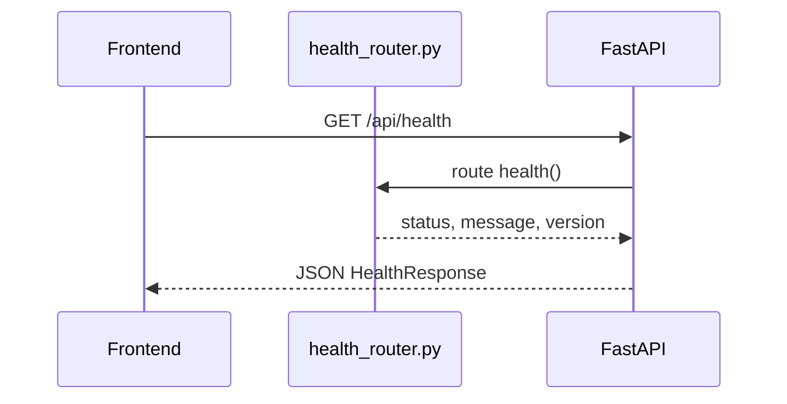
#Status Service
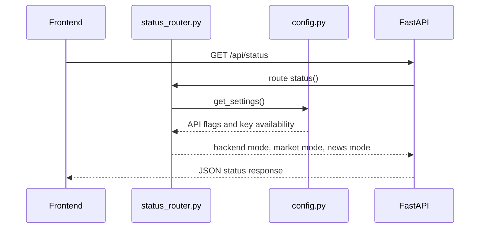
#Market Summary Service
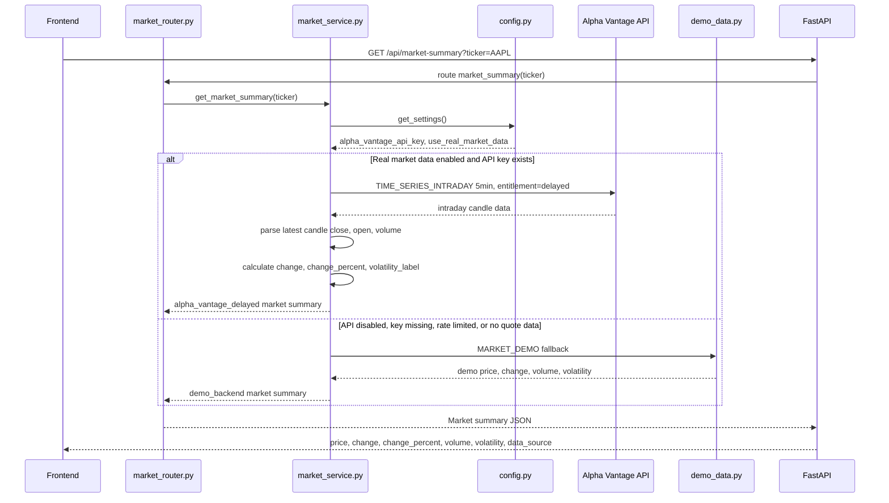

#Candles Service
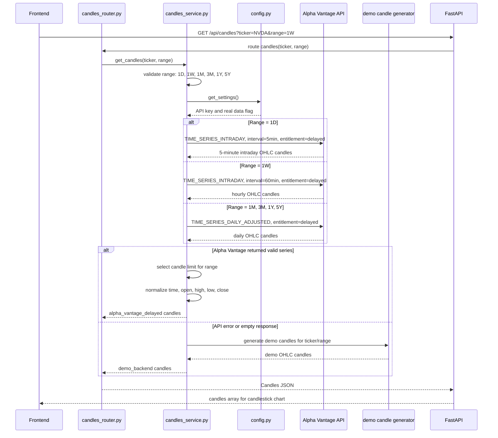
#Forecast Service
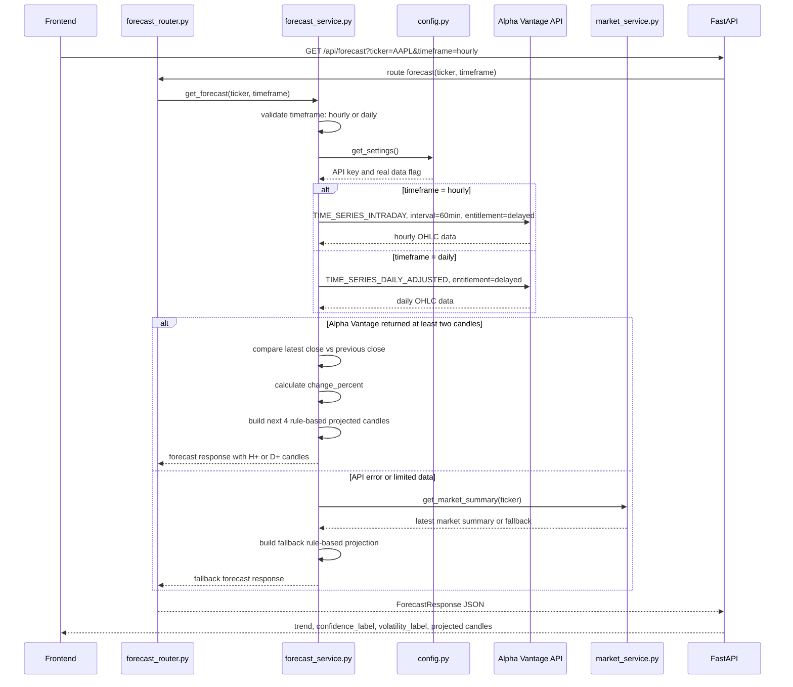
#Forecast Insight Service
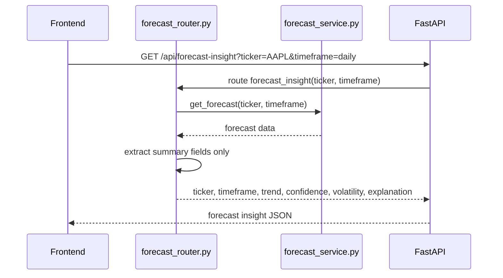
#Prediction Service
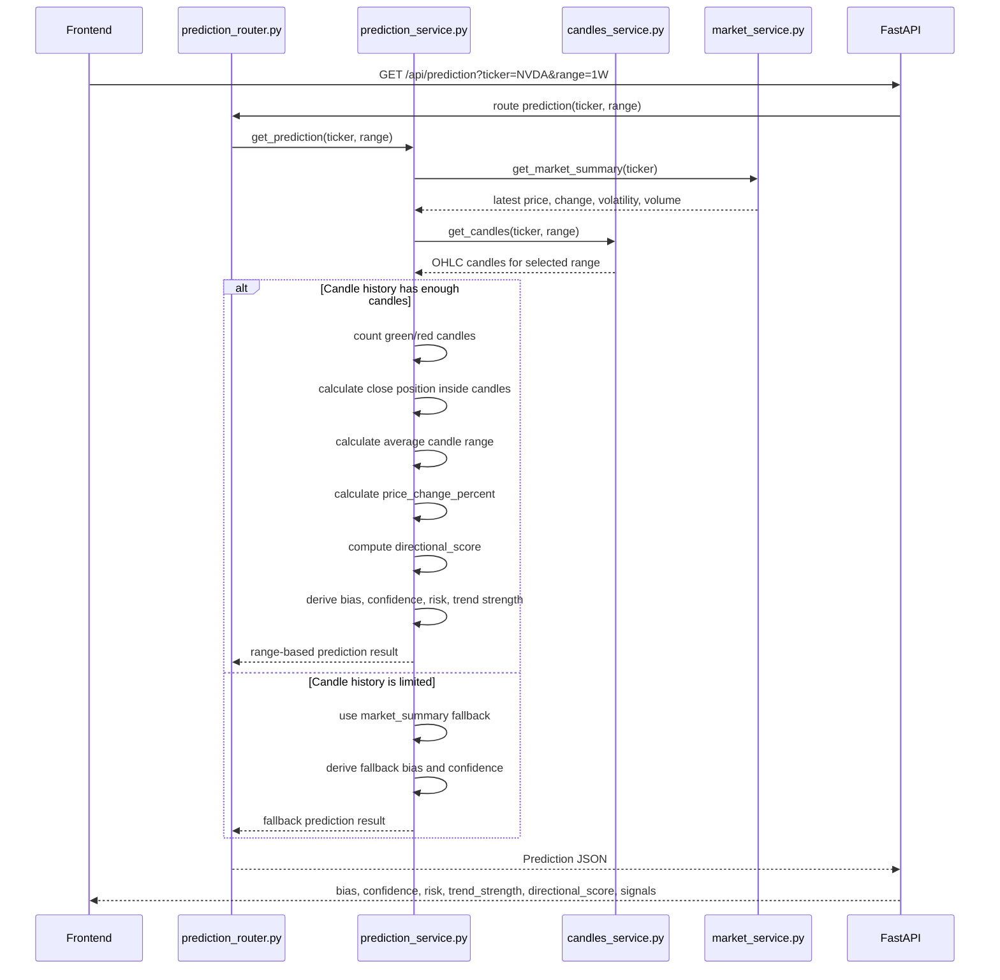
#News Service
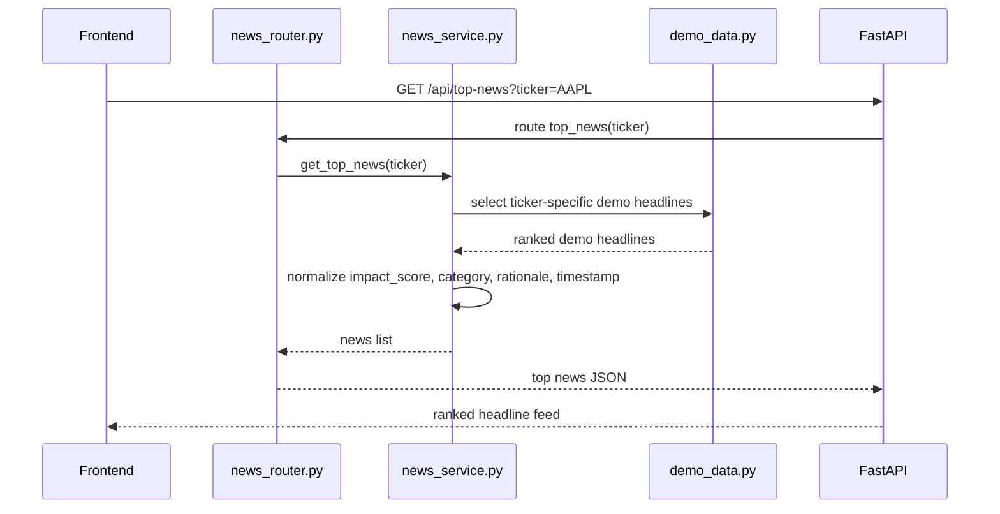
#Watchlist Service
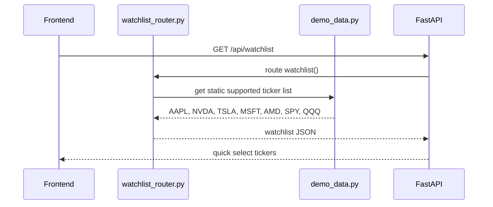
#Frontend Stock Search and Analysis Flow
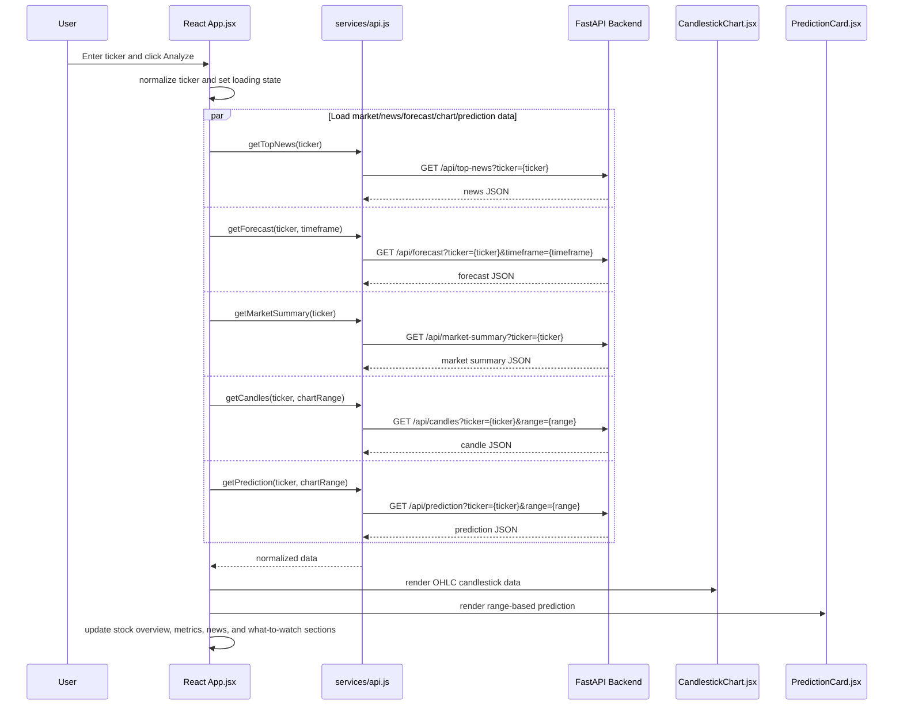
#Chart Range Change Flow
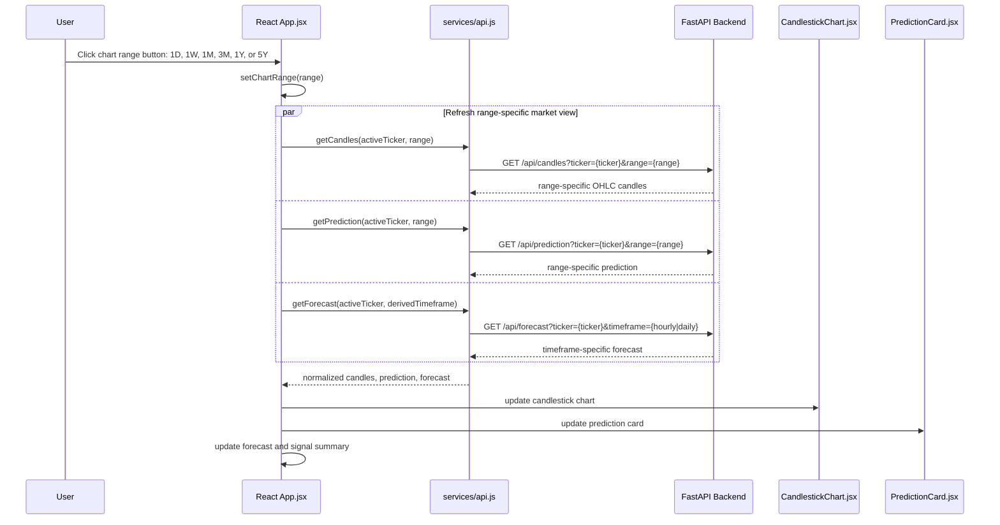
#Fallback Data Flow
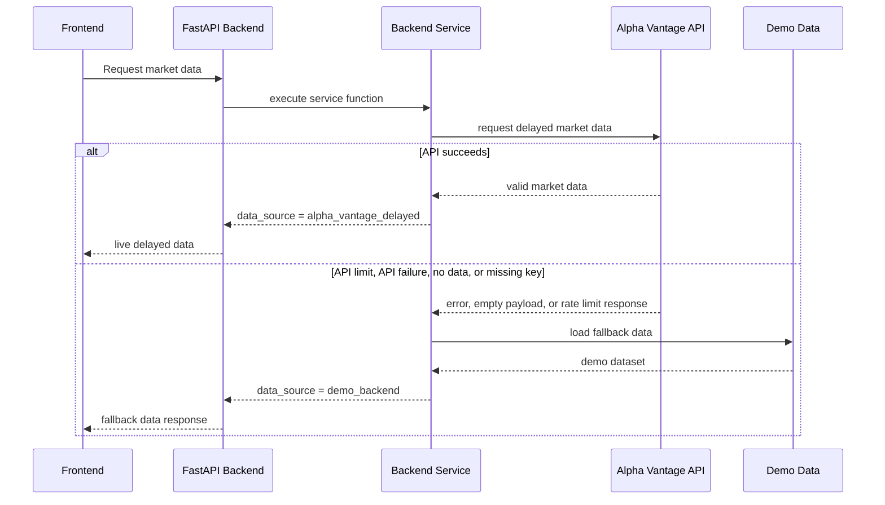